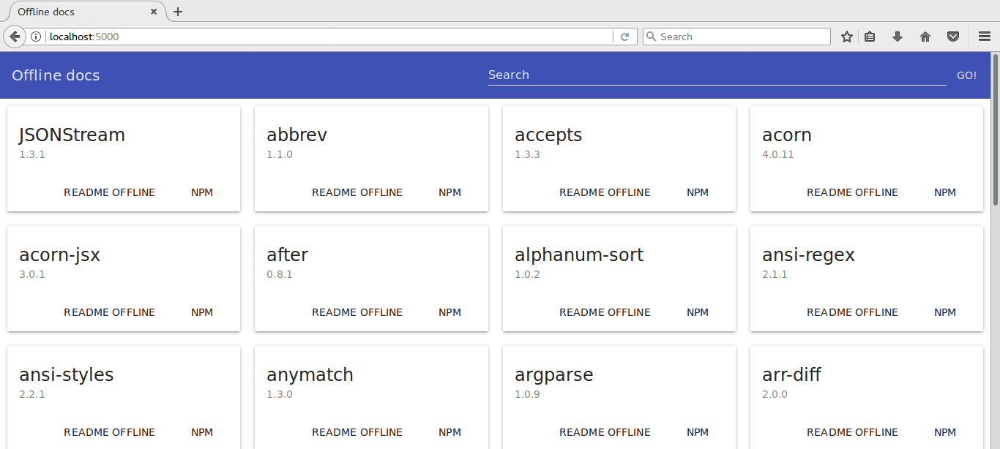

# offdocs 
### Based on https://github.com/vvo/offline-docs


Always get some documentation on the modules you use, even offline.

No network no work? WRONG! Get the minimum documentation when you need it.

```shell
npm install -g offdocs
cd awesomeNodeJSProject
offdocs
# Offline docs server listening on http://0.0.0.0:5000
```

Now go to http://0.0.0.0:5000 to see offline docs.

This module may also be usefull in situations where you do have network. It shows all you module dependencies and documentation on a simple page.

## contribute

```shell
git clone git@github.com:gmarcos87/offdocs.git
cd offdocs
npm run dev
```

Now go to http://localhost:3000, edit the files, it reloads automatically and PR!
